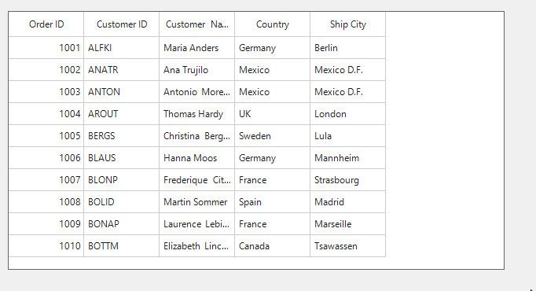

# How to display a hand cursor when hovering over a column in WinForms DataGrid?

In [WinForms DataGrid](https://www.syncfusion.com/winforms-ui-controls/datagrid) (SfDataGrid), the default cursor that appears when hovering over a column is the arrow cursor. However, this behavior can be customized to display a hand cursor when the mouse hovers over a column and revert to the default arrow cursor when the mouse leaves. This can be achieved by handling the MouseMove event of the [TableControl](https://help.syncfusion.com/cr/windowsforms/Syncfusion.WinForms.DataGrid.SfDataGrid.html#Syncfusion_WinForms_DataGrid_SfDataGrid_TableControl), where the cursor is set to **Cursors.Hand** when hovering over a valid column and reset to **Cursors.Arrow** otherwise.

```csharp
// Event subscription
sfDataGrid1.TableControl.MouseMove += OnTableControlMouseMove;

//Event Customization
private void OnTableControlMouseMove(object? sender, MouseEventArgs e)
{
    // Get the row and column index at the mouse position
    var rowColumnIndex = sfDataGrid1.TableControl.PointToCellRowColumnIndex(e.Location);

    // Check if mouse is over a valid column
    if (rowColumnIndex.ColumnIndex > -1)
    {
        // Change to hand cursor when hovering over the columns
        Cursor = Cursors.Hand;
    }
    else
    {
        // Reset cursor to default when not over any column
        Cursor = Cursors.Arrow;
    }
}
```



Take a moment to peruse the [WinForms DataGrid - Events](https://help.syncfusion.com/windowsforms/datagrid/gettingstarted#handling-events) documentation, where you can find about the events with code examples.
